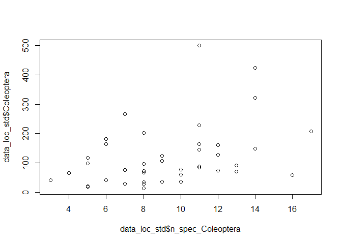

Chapter 18
================
Remco Ploeg
2023-03-03

This is a single sentence.

``` r
library(tidyverse)
```

    ## Warning: package 'tidyverse' was built under R version 4.1.3

    ## Warning: package 'ggplot2' was built under R version 4.1.3

    ## Warning: package 'tibble' was built under R version 4.1.3

    ## Warning: package 'tidyr' was built under R version 4.1.3

    ## Warning: package 'readr' was built under R version 4.1.3

    ## Warning: package 'purrr' was built under R version 4.1.3

    ## Warning: package 'dplyr' was built under R version 4.1.3

    ## Warning: package 'stringr' was built under R version 4.1.3

    ## Warning: package 'forcats' was built under R version 4.1.3

    ## Warning: package 'lubridate' was built under R version 4.1.3

    ## -- Attaching core tidyverse packages ------------------------ tidyverse 2.0.0 --
    ## v dplyr     1.1.0     v readr     2.1.4
    ## v forcats   1.0.0     v stringr   1.5.0
    ## v ggplot2   3.4.1     v tibble    3.1.8
    ## v lubridate 1.9.2     v tidyr     1.3.0
    ## v purrr     1.0.1     
    ## -- Conflicts ------------------------------------------ tidyverse_conflicts() --
    ## x dplyr::filter() masks stats::filter()
    ## x dplyr::lag()    masks stats::lag()
    ## i Use the ]8;;http://conflicted.r-lib.org/conflicted package]8;; to force all conflicts to become errors

``` r
data_loc_std<-read.csv("C:/Users/Remco/OneDrive - Wageningen University & Research/Documenten/1. Wageningen/Thesis/Analyse/Output/data_loc_std.csv")
plot(data_loc_std$n_spec_Coleoptera,data_loc_std$Coleoptera)
```

<!-- -->
